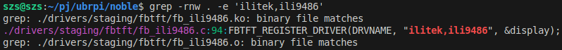
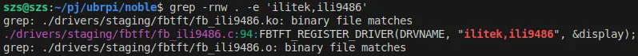
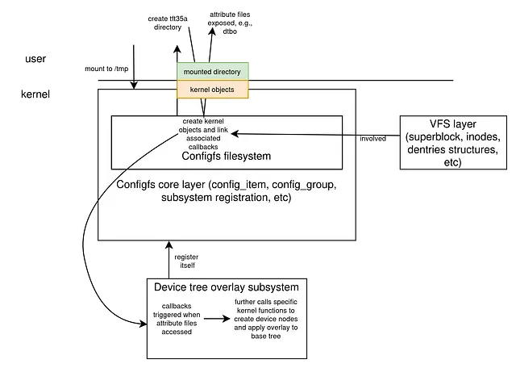
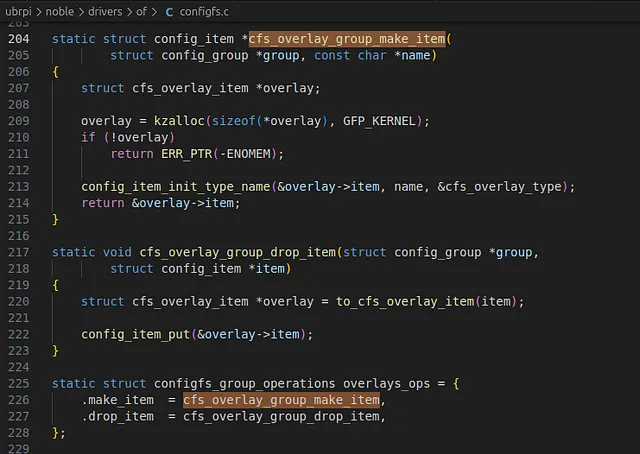
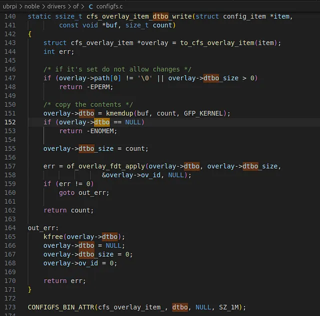

## From touch LCD to Rust Kernel Driver: A Kernel Hacking Odyssey — Part 1: Device trees and source code plunge

I’m here to share my journey through a series of (somewhat feeble) attempts to interface a simple LCD with my old Raspberry Pi 4B+. Why take on such an endeavor? The spark came from a job-interview case study:design a Linux touchscreen driver while properly leveraging the kernel’s power-management and energy-efficiency features. Being over-ambitious and optimistic about my Linux kernel hacking skills, I decided to also present a live demo of my design. I had a couple of days, so I ordered a cheap touchscreen LCD from Amazon, hooked it up to the Pi, sat down with a cup of coffee, and figured it would be done in an hour.

Before I get into how I epically failed, I should mention that I’d been working with the Linux kernel and driver development for the past few years, so, being outwardly modest, I considered myself at least an intermediate Linux ninja. Things didn’t go as planned. The device-tree overlay I found on the internet, supposedly made for this exact panel, didn’t work. I had worked with device trees before, but I couldn’t figure out what the error message meant when I tried to load it as an overlay (we’ll get into overlays later). All I got was the backlight turning on, proof that power was reaching the panel, and nothing else.

So I never even got past the first step of bringing up a simple peripheral. Needless to say, I didn’t get a callback. But every cloud has a silver lining (or however the saying goes). The failure motivated me to actually finish the project, test my kernel skills, and finally learn the things I’d been putting off — mainly kernel profiling tools (ftrace, perf, eBPF), Rust for Linux, and and improve upon my existing Yocto knowledge.

That’s the whole point of this series: using this cheap LCD + Raspberry Pi as a real-world example to explore those topics properly (and maybe some additional interesting side routes we find on the way).

This series is aimed at intermediate kernel nerds, so I won’t dive into the absolute basics of kernel functionality. But I’ll try to elaborate as much as possible on the things that aren’t always obvious when you’re learning Linux. The ideal reader will have at least some basic knowledge of device trees (what they are, why they’re necessary), kernel vs. userspace, implementing simple kernel drivers, and some kernel resource management. For the overly committed beginners pushing through, I’ll add side notes on core concepts where needed.

This first article focuses on simply investigating and understanding the device tree overlay framework to pin point the source of the error. The LCD I bought is the MHS-3.5-inch (320x480 resistive touchscreen, SPI-based, SKU MHS3528). There’s a GitHub repo for installing it on Raspbian OS (goodtft/LCD-show), which includes a script that loads the DTB overlay and driver module. I’ve never used Raspbian, and just installing it on my Pi may have solved my original goal in a jiffy. But I was curious why the LCD wasn’t interfacing as easily with the Ubuntu 24.04 (Noble) I was running on my Raspberry Pi, even though both are based on the Linux kernel underneath. Anyway, I also got a concrete example to learn more about Linux profiling tools and RUST.

So buckle up , until either a catastrophic panic (no pun intended) convinces me to give up, or we actually reach the destination safely.

### Reproducing the error
An essential part of kernel development (and software development in general) is reliably reproducing an error, so it can be investigated in the exact state in which it occurred. At that point further investigations can be performed. So this is what we will start with.

We have a raspberry pi 4B+ running a Ubuntu core noble with a kernel version of 6.8.0:

_ubuntu@ubuntu:~$ uname -a
Linux ubuntu 6.8.0–1042-raspi #46-Ubuntu SMP PREEMPT_DYNAMIC Tue Oct 14 18:59:27 UTC 2025 aarch64 aarch64 aarch64 GNU/Linux_

> For newbies → Although all of Linux distributions run a kernel version at their core, nearly every distro maintains their own fork. They start from a vanilla upstream kernel (the one Linus himself merges), then apply their own patches for hardware support, features, and OS compatibility with the rest of the distribution. The output from uname tells us that the kernel version is 6.8.0. The -raspi tag and the build number (#46) tell us this is Ubuntu’s custom kernel tree specifically for Raspberry Pi boards, maintained in their own Git repository. That’s why an overlay that works perfectly on Raspbian can mysteriously explode on Ubuntu, even if both are “Linux 6.8”, because the device-tree overlay machinery, config options, and sometimes even subtle driver behavior differ between the two branches.

The cheap touchscreen LCD I bought: https://www.amazon.co.uk/dp/B01MRQTMTD?ref=ppx_yo2ov_dt_b_fed_asin_title&th=1 (MHS-3.5", ILI9486 + XPT2046 over SPI). The GitHub repo that makes it work on Raspbian: https://github.com/goodtft/LCD-show. It contains a single script (MHS35-show) you download and run on the Pi. The script detects the panel, loads the correct pre-compiled .dtbo overlay (https://github.com/goodtft/LCD-show/blob/master/usr/tft35a-overlay.dtb), does some x11 and xserver related magic (which I am too lazy to trouble myself with atm), passes a few module parameters to the kernel driver, and voila… supposedly a fully working touchscreen.

> newbies → A device tree is a simple data file that describes the hardware the kernel is running on. At boot, the kernel loads a base device tree (usually baked into the kernel image) and parses it to discover what hardware exists — CPUs, memory, UARTs, SPI controllers, etc., and then loads the appropriate drivers for each compatible device. Later, after the system is already running, you can add or modify hardware descriptions without rebooting. That’s where device-tree overlays come in: you feed the kernel a small overlay file (a .dtbo), the kernel merges it into the live device tree, and any newly described devices automatically get their drivers probed and bound, exactly what we’re trying to do with this LCD panel.

That’s exactly what we want to do on Ubuntu: load the same overlay and let the kernel bring up the panel. Unfortunately (or fortunately), it doesn’t work out of the box on Ubuntu 24.04. The overlay loads for a split second and immediately fails with a cryptic -EINVAL from deep inside the device-tree overlay framework code. The image below shows, at a high level, how a device tree overlay is loaded. The steps to load the overlay file is as follows: The configfs filesystem is mounted, a directory ‘tft35a’ (any random name can be given) is created under the ‘overlays’ hierarchy. The directory creation automatically also creates files e.g., ‘dtbo’, within the folder and the compiled .dtbo file is written into the dtbo file. This write triggers the kernel to perform some magic behind the scenes to load and apply the overlay (details we will dig into later).



> newbies → configfs is a RAM-backed virtual filesystem, meaning it only lives in memory and nothing is written permanently to disk. Like sysfs, it exposes kernel objects to user space. The key difference is that configfs actually allows user space to create and destroy kernel objects by creating or removing directories and files inside it. Sysfs does not allow that; it only lets you read or write existing attributes. Because of this, configfs is often used for runtime, dynamic configuration of kernel subsystems without needing to recompile the kernel. And this fits with the requirements of the Device Tree Overlay subsystem, which relies on creating special files as user interface to allow users to load overlay files. Several frameworks rely on configfs, such as the USB gadget framework and the Device Tree Overlay subsystem, and such subsystems must first register itself with the configfs framework to have its user interface visible upon mounting of the filesystem, which the device tree overlay subsystem already does by itself.

A seasoned kernel developer might immediately recognize what the log is hinting at, but here’s what I could infer: the overlay application seems to fail somewhere inside the overlay-handling code, returning error -22 (EINVAL). The messages also suggest the failure involves phandles, which are internal references used within device-tree files. We’ll dig into those shortly.

There are several ways to approach this problem, but for the sake of this article (and to flex my self-proclaimed linux knowledge) I’m taking a more systematic route: dig into how the device-tree overlay actually works, walk through the overlay framework’s code paths, and build an understanding of the mechanisms before relying on external tools. This is the style of debugging many kernel developers follow — the way I was taught to reason about kernel-level issues atleast, because it forces you to understand the underlying abstractions rather than just the symptoms. Anyways, directly jumping to analysis tools will help little if we have no idea how the corresponding kernel frameworks are functioning.

### Understanding the device tree
The first step is simply to inspect the tft35a-overlay.dtb file to understand what the overlay contains. This also provides a natural point to introduce a few device-tree concepts that are important when working with overlays. A .dtb (or .dtbo) file is a compiled Device Tree Blob, a binary format, which can also be converted back into a readable source form using the Device Tree Compiler (dtc). This gives us a .dts file that we can actually read, analyze, and modify.

_$ dtc -I dtb -O dts tft35a-overlay.dtb > tft35a-overlay.dts_

Lets look at the contents of the tft35a-overlay.dts file that we generated.

```
/dts-v1/;

/ {
 compatible = "brcm,bcm2835\0brcm,bcm2708\0brcm,bcm2709";

 fragment@0 {
  target = <0xdeadbeef>;

  __overlay__ {
   status = "okay";

   spidev@0 {
    status = "disabled";
   };

   spidev@1 {
    status = "disabled";
   };
  };
 };

 fragment@1 {
  target = <0xdeadbeef>;

  __overlay__ {

   tft35a_pins {
    brcm,pins = <0x11 0x19 0x18>;
    brcm,function = <0x00 0x00 0x00>;
    linux,phandle = <0x01>;
    phandle = <0x01>;
   };
  };
 };

 fragment@2 {
  target = <0xdeadbeef>;

  __overlay__ {
   #address-cells = <0x01>;
   #size-cells = <0x00>;

   tft35a@0 {
    compatible = "ilitek,ili9486";
    reg = <0x00>;
    pinctrl-names = "default";
    pinctrl-0 = <0x01>;
    spi-max-frequency = <0xf42400>;
    txbuflen = <0x8000>;
    rotate = <0x5a>;
    bgr = <0x00>;
    fps = <0x1e>;
    buswidth = <0x08>;
    regwidth = <0x10>;
    reset-gpios = <0xdeadbeef 0x19 0x01>;
    dc-gpios = <0xdeadbeef 0x18 0x00>;
    debug = <0x00>;
    init = <0x10000f1 0x36 0x04 0x00 0x3c 0x0f 0x8f 0x10000f2 0x18 0xa3 0x12 0x02 0xb2 0x12 0xff 0x10 0x00 0x10000f8 0x21 0x04 0x10000f9 0x00 0x08 0x1000036 0x08 0x10000b4 0x00 0x10000c1 0x41 0x10000c5 0x00 0x91 0x80 0x00 0x10000e0 0x0f 0x1f 0x1c 0x0c 0x0f 0x08 0x48 0x98 0x37 0x0a 0x13 0x04 0x11 0x0d 0x00 0x10000e1 0x0f 0x32 0x2e 0x0b 0x0d 0x05 0x47 0x75 0x37 0x06 0x10 0x03 0x24 0x20 0x00 0x100003a 0x55 0x1000011 0x1000036 0x28 0x20000ff 0x1000029>;
    linux,phandle = <0x02>;
    phandle = <0x02>;
   };

   tft35a-ts@1 {
    compatible = "ti,ads7846";
    reg = <0x01>;
    spi-max-frequency = <0x1e8480>;
    interrupts = <0x11 0x02>;
    interrupt-parent = <0xdeadbeef>;
    pendown-gpio = <0xdeadbeef 0x11 0x01>;
    ti,x-plate-ohms = [00 3c];
    ti,pressure-max = [00 ff];
    linux,phandle = <0x03>;
    phandle = <0x03>;
   };
  };
 };

 __overrides__ {
  speed = <0x02 0x7370692d 0x6d61782d 0x66726571 0x75656e63 0x793a3000>;
  txbuflen = [00 00 00 02 74 78 62 75 66 6c 65 6e 3a 30 00];
  rotate = [00 00 00 02 72 6f 74 61 74 65 3a 30 00];
  fps = [00 00 00 02 66 70 73 3a 30 00];
  bgr = [00 00 00 02 62 67 72 3a 30 00];
  debug = <0x02 0x64656275 0x673a3000>;
  swapxy = <0x03 0x74692c73 0x7761702d 0x78793f00>;
 };

 __symbols__ {
  tft35a_pins = "/fragment@1/__overlay__/tft35a_pins";
  tft35a = "/fragment@2/__overlay__/tft35a@0";
  tft35a_ts = "/fragment@2/__overlay__/tft35a-ts@1";
 };

 __fixups__ {
  spi0 = "/fragment@0:target:0\0/fragment@2:target:0";
  gpio = "/fragment@1:target:0\0/fragment@2/__overlay__/tft35a@0:reset-gpios:0\0/fragment@2/__overlay__/tft35a@0:dc-gpios:0\0/fragment@2/__overlay__/tft35a-ts@1:interrupt-parent:0\0/fragment@2/__overlay__/tft35a-ts@1:pendown-gpio:0";
 };

 __local_fixups__ {
  fixup = "/fragment@2/__overlay__/tft35a@0:pinctrl-0:0\0/__overrides__:speed:0\0/__overrides__:txbuflen:0\0/__overrides__:rotate:0\0/__overrides__:fps:0\0/__overrides__:bgr:0\0/__overrides__:debug:0\0/__overrides__:swapxy:0";
 };
};
```
Lets walk through this device overlay to try to understand components that make up the device and its configuration. Maybe we find out what the problem directly or at least will aid us later on in creating/understanding the driver for this device. A device tree overlay consists of nodes that either introduce new devices or components to the base device tree, or reference existing nodes to modify or extend their properties. This short documentation snippet (https://github.com/raspberrypi/documentation/blob/master/documentation/asciidoc/computers/configuration/device-tree.adoc) on device trees and overlays perfectly sums up how this overlay file is defined and explains why the file contains mindboggling references like 0xdeadbeef, various phandles and sections like __symbols__, __fixups__ and __local_fixups__. I would highly recommend going through it (atleast until (and including) section ‘Fragments’) before proceeding.

The root node declares compatibility with the specific Broadcom SoCs. This is just a safety check so the kernel rejects the overlay if it’s loaded on the wrong board. fragment@0 targets the &spi0 (original dts was probably target = <&spi0>, but the compiler added the 0xdeadbeef reference (reasons mentioned in the documentation link I mentioned above), which is later resolved via __fixups__ node. Since __overlay__ block within the fragment contains the actual changes to apply to the targeted node, we see it disabling spidev@0 and spidev@1, which are probably generic spi lines and disabling allows the LCD and touchscreen (which are both spi based) to claim the bus to interact with the main spi controller.

fragment@1 seems to target the GPIO controller and introduces a tft35a_pins node containing properties specific for RPI (https://www.kernel.org/doc/Documentation/devicetree/bindings/pinctrl/brcm,bcm2835-gpio.txt). It specifies gpio pins 0x11, 0x19 and 0x18 as input. I suppose these are required to configure the display. It also contains phandle to pinctrl-0 in __local_fixups__ which should be resolved by the compiler. A phandle is a property that is used to reference between nodes. Defining the phandle = <0x01> here allows other nodes to reference this node by using the value 0x01 in there own node as done in fragment@2.

fragment@2 describes two devices on the SPI bus, with the target resolved via the __fixups__ section to the spi0 controller. Judging by the names, the second child node tft35a-ts@1 represents the touchscreen component, while the first node tft35a@0 corresponds to the LCD display. Each device node has its own compatible string, indicating that a separate driver is responsible for each component.The tft35a@0 node defines a set of parameters that the LCD driver reads to initialize and operate the display. One important property is pinctrl-0 = <0x01>, which references the phandle defined in fragment@1. This instructs the pinctrl subsystem to apply the pin configuration described by the tft35a_pins node to the LCD device. The node also defines its own phandle (0x02), which is later referenced in the __overrides__ block to allow runtime modification of several LCD-related parameters.For the tft35a-ts@1 node, the presence of an interrupts property indicates that touchscreen events are delivered to the kernel and driver via interrupts. This node defines its own phandle (0x03), which is again referenced in the __overrides__ section, this time to control the swapxy parameter. Finally, all placeholder values set to 0xdeadbeef are resolved at overlay application time using the mappings provided in the __fixups__ section.

The overrides node defines tunable parameters that the user can modify at boot time using command-line, e.g., tft35a.speed=xxx. These override entries are linked to the specific phandles within the overlay so that the kernel can adjust properties dynamically without recompiling the overlay.

The fixups node defines how unresolved references like 0xdeadbeef should be replaced with actual phandles from the base device tree. Since overlays are compiled separately, the cannot know the exact phandle of the base tree in advance. The fixups maps path-locations in the overlay with symbolic labels (e.g., spi0, gpio) that point to nodes in the base tree. During overlay application, all instances of 0xdeadbeef in those locations are replaced with the real phandle of the SPI and GPIO controller.

Similarly, local_fixups resolves references within the overlay itself. It adjusts phandles insider properties like pinctrl-0 and the override entries so that internal references remain consistent.

Symbols, I suppose, acts as aliases to simplify debugging and referencing between device tree files.

__It is ok if you don’t understand this complete run down of the overlay file at this moment. Just a general overview is sufficient. We will come back to this again when investigating and writing the driver.__

After reviewing the device-tree source, nothing jumps out as an obvious culprit. The kernel error pointed to a phandle issue and returned -22 (EINVAL), so it’s reasonable to suspect that one of the three phandles defined in the overlay is invalid maybe, however, it’s not immediately clear which one is failing, or why.

So, next course of action is diving into the source code to understand specifics this framework.

## Sourcecode plunge
> newbies: Kernel sources are available from several places. The main one is the ‘vanilla’ Linux kernel , which is the upstream source maintained by Linus Torvalds and the subsystem maintainers. It includes the core components e.g., the scheduler, memory management, networking stack, VFS, etc., along with a huge collection of in-tree subsystems such as DRM, ALSA, input, power management, device-mapper, and tons of architecture-specific code. It also ships with a wide range of vendor and community-maintained drivers that have made it through the upstream review process and been accepted by the kernel maintainers.

> Using the vanilla kernel as a base, many vendors apply their own patches so the kernel can run on their specific hardware. These vendor-modified kernels are typically maintained separately , often on GitHub, and must remain open source because the Linux kernel is licensed under the GPL. For example, Xilinx maintains its patched kernel tree at https://github.com/Xilinx/linux-xlnx, with branches that track different upstream versions such as 5.4 or 6.6. Since the issue we’re chasing appears to involve core, upstream functionality rather than vendor-specific code, it makes sense to start our investigation with the vanilla sources. The easiest place to browse those sources is bootlin’s online kernel navigator https://elixir.bootlin.com/.

The device tree overlay shows that the hardware is handled by two drivers: one for the LCD dispaly and another for the touchscreen. Starting with the LCD side, which is the simpler of the two, the associated driver resides in drivers/staging/fbtft/fb_ili9486.c, which I found out by greping for the compatible string in kernel sources on my local machine.



> newbies → The kernel sources are well organized and hierarchically structured. Normally, kernel drivers are placed according to subsystem (for example, LED drivers live in drivers/leds/). A fully upstream-ready display driver would typically sit under drivers/gpu/drm/tiny/ or maybedrivers/video/. The reason this driver lives in the staging directory is that the entire fbtft subsystem is considered incomplete and not aligned with current kernel standards. Staging is effectively a holding area for code that works but has pending issues, e.g, missing documentation, non-standard APIs, etc. Only once it meets upstream expectations would it be promoted to its proper subsystem directory.

The code for the ILI9486 driver is fairly small, around a hundred lines, because most of the real work is delegated to the FBTFT_REGISTER_DRIVER() macro https://elixir.bootlin.com/linux/v6.8/source/drivers/staging/fbtft/fb_ili9486.c#L94. This macro expands into standard probe and remove callbacks (fbtft_probe_common() and fbtft_remove_common()), which implement the bulk of the logic. Inside the probe path https://elixir.bootlin.com/linux/v6.8/source/drivers/staging/fbtft/fbtft-core.c#L1136, configuration values from the device tree overlay are read using helpers such as fbtft_properties_read(), which picks up properties we saw defined in the overlay e.g., rotate, txbuflen, etc. Using these, the framework initializes framebuffer-related structures and sets up device registers and parameters accordingly. It then fills out an operations structure and finally registers the device with the framebuffer framework.

> newbie →Modern kernel subsystems provide a lot of boilerplate and standardized functionality for devices within the same class, which is why choosing the correct subsystem for a driver is so important. You automatically gain a large amount of existing infrastructure, you only implement the device-specific pieces, and userspace can interact with the driver in a predictable, documented way. The usual pattern is: initialize the subsystem-specific structures, provide callbacks for device-specific operations, and then register everything using the subsystem’s registration API.

In this driver’s case, a struct fb_info https://elixir.bootlin.com/linux/v6.8/source/drivers/staging/fbtft/fbtft-core.c#L1136 describes the framebuffer device and includes an fbtftops operations structure. The driver assigns its own functions to selected callbacks in fbtftopshttps://elixir.bootlin.com/linux/v6.8/source/drivers/staging/fbtft/fbtft-core.c#L1136.Once everything is prepared, the driver registers the framebuffer through fbtft_register_framebuffer()https://elixir.bootlin.com/linux/v6.8/source/drivers/staging/fbtft/fbtft-core.c#L1136. At that point, the kernel becomes aware of the device, userspace can see a new framebuffer node, and any user operations flow through the framebuffer framework into the driver’s callbacks.

In our case, none of this driver logic even runs yet I think. The error we’re seeing occurs probably occurs before this driver is probed — during the application of the device-tree overlay itself. Since overlay handling happens long before the framebuffer driver is instantiated, digging through this driver source hasn’t helped us so far (but will help us when we try to integrate the driver). The kernel will only trigger the driver after the overlay is successfully merged into the base device tree. Because the failure seems to occurs earlier in the chain, the next logical step I guess would be to investigate the overlay-loading path itself. We know that the configfs is involved in the overlay loading so we can start with that.

## Device overlays and configfs

A good way to approach this is by asking focused questions about the subsystem and answering them by reading the code.

Q1 — How is device-tree information stored inside the kernel?

Device-tree information is stored in kernel memory as a hierarchical tree of struct device_node objects. During early boot, the kernel loads the Flattened Device Tree (FDT) blob into RAM. This blob is then parsed, and for each node in the tree, the kernel allocates a corresponding struct device_node. Each device_node contains the node name, properties (such as compatible, status, reg, etc.), and pointers linking it to its parent, children, and siblings. This structure is defined in include/linux/of.h. That header also declares many helper APIs used to query properties, traverse the tree, and match device-tree nodes to drivers. The actual implementations of most OF (Open Firmware) helpers live under drivers/of/. At runtime, this in-memory tree is considered the authoritative representation of the system’s hardware description.

Q2 — What happens when a device-tree overlay is applied via configfs? Which parts of the kernel are involved, and which functions are actually called?

Several files appear relevant here: overlay.c and dynamic.c in the OF subsystem, and the configfs implementation itself under include/linux/configfs.h(https://elixir.bootlin.com/linux/v6.8/source/include/linux/configfs.h) and fs/configfs/. The sketch below summaries how these multiple subsystems are jigsawed together: 


To understand the full picture, it helps to start with configfs and then follow the path into the device-tree overlay code.

As mentioned earlier, configfs provides a filesystem-based user interface that allows userspace to configure kernel subsystems at runtime. After mounting configfs, users can create directories and files. These filesystem objects are backed by kernel data structures so the kernel can track their lifetime and access. In configfs, each directory or file corresponds to a config_item (and related structures), not directly to a generic virtual filesystem (VFS) file or inode alone. While many kernel objects are represented by kobjects (especially in sysfs), configfs uses its own object model (config_item, config_group, etc.) that is internally integrated with the VFS layer. This allows configfs to map filesystem operations to subsystem-specific kernel objects. This involves standard VFS concepts such as superblocks, inodes, and dentries, but those details are beyond the scope of this article. For readers interested in learning more about virtual filesystems, ramfs is a good minimal example to study, as it demonstrates the core mechanics of an in-memory filesystem:
https://elixir.bootlin.com/linux/v6.8/source/fs/ramfs. At a high level, the filesystem logic is responsible for creating, tracking, and managing files and directories inside the mounted filesystem. Each file or directory has a set of associated operations, and these operations are implemented as callbacks by the developer that define what happens when userspace reads from, writes to, creates, or removes them.

> newbies → Usually files and directories are catered for by the VFS framework and structures supported by the VFS framework alone. However, some frameworks, e.g. the configfs also use their own additional structures for bookkeeping etc. Such files typically expose callback functions implemented by the kernel or subsystem developer. These callbacks are invoked when userspace performs operations such as reading from or writing to a file. The callbacks then perform whatever action the subsystem intends to associate with that filesystem operation. In our example, the device overlay subsystem registers itself with the configfs framework so that when files are created within the overlay directory present in the mounted configfs, the attribute files from the overlay framework are exposed to the user and corresponding callbacks in the same framework are triggered when the user interacts with them.

The configfs.h header defines the core data structures used by configfs:struct config_item, struct config_group, struct config_item_type, config_item, ,struct configfs_attribute, struct configfs_subsystem. These structures form the model for configfs and expose it to userspace as a filesystem. The official documentation for these concepts can be found in:Documentation/filesystems/configfs.rst
Each of these structures are necessary in managing the configfs filesystem on the kernel side and each has associated operations tables (for example, item operations and group operations) and callbacks that need to be implemented allow a subsystem to define what happens when users create directories, remove them, or read/write attribute files.
Any kernel subsystem that wants to expose runtime configuration through configfs must register itself by calling configfs_register_subsystem(). In doing so, it provides a configfs_subsystem structure along with the relevant callbacks that define how objects are created, destroyed, and accessed.
The device-tree overlay framework by default integrates with configfs and registers itself as a configfs subsystem. That is why, once configfs is mounted, the device-tree/overlays directory automatically appears without any additional setup from userspace.
This also implies that somewhere in the overlay framework code, configfs_register_subsystem() is called with a device-tree–specific subsystem definition. As users, we do not need to implement any of this logic ourselves-we only interact with the exposed interface.
All we do is use the interface to load the file, but with some extra steps. As I showed you when loading the dtbo, I had to first create a directory within the overlay directory which then presented 3 files that I could use for the purpose of loading the overlay. This directory creation is necessary because it allocates and initializes the internal kernel objects that will later receive and process the overlay blob. As you observed, creating this directory causes several files (such as dtbo, status, and path) to appear which are attribute files managed by the overlay framework, which together with configfs form the interface used to load and manage the overlay. With this understanding in place, we can now look more closely at what happens inside the device-tree overlay framework when these callbacks are invoked.

Q3 — what happens when a user loads an overlay

When the user mounts configfs, the kernel creates a superblock for the filesystem along with the associated root inode and dentry structures. During this process, configfs associates the root directory with the global list of registered configfs subsystems.

As part of the mount operation, the fill_super logic (implemented primarily in fs/configfs/dir.c) iterates over all registered subsystems and creates a top-level directory for each one. Since the device-tree overlay framework has already registered itself as a configfs subsystem, its directory appears automatically. This is why, after mounting configfs, the device-tree/ directory becomes visible without any additional user action.

If the user now creates a directory under this hierarchy—for example:
_mkdir /tmp/device-tree/overlays/tft35a_

configfs invokes configfs_mkdir(), which is implemented in the configfs core. This function does not itself know anything about device-tree overlays. Instead, it dispatches the operation to the make_item() callback that was provided by the owning subsystem(in this case the overlay subsystem) when it registered itself via configfs_register_subsystem().

Because this directory is being created under the context of the device-tree overlay subsystem, configfs routes the request to the overlay framework’s callback. That callback is implemented as cfs_overlay_group_make_item() in the overlay code. This function is responsible for allocating and initializing a new overlay object and exposing its user interface through configfs.



cfs_overlay_group_make_item() sets up a new overlay instance and creates several attribute files under the newly created directory, most notably: path, status and dtbo. Each of these files is a configfs attribute and has associated read and/or write callbacks implemented in the overlay subsystem kernel sources. Whenever userspace reads from or writes to one of these files, the corresponding callback function is invoked. The most important attribute here is dtbo. This file is defined using the CONFIGFS_BIN_ATTR() macro, which associates binary read/write callbacks with the file. In this case, the write callback is cfs_overlay_item_dtbo_write().



> newbies → Using macros to associate files with callbacks is common in kernel code. Naming conventions are often used so that a single macro invocation can bind both read and write handlers based on a shared function prefix name.

And that’s it. At this point the overlay framework is ready to accept the overlay file. Writing a compiled overlay blob into the dtbo file triggers the cfs_overlay_item_dtbo_write() callback. This is the entry point where the overlay framework takes over. Now if the user writes the overlay blob into the ‘dtbo’ attribute file, this should trigger the write callback associated to the file cfs_overlay_item_dtbo_write(), which in itself will call further functions to apply the overlay. We can see from the above code image that the function of_overlay_fdt_apply() https://elixir.bootlin.com/linux/v6.8/source/drivers/of/overlay.c#L968 being called, passing the overlay buffer (flattened overlay blob) and its size. This function https://elixir.bootlin.com/linux/v6.8/source/drivers/of/overlay.c#L1050 seems to parse the overlay blob via the function of_fdt_unflatten_tree() which through a series of function calls, unflattens the blob, it that it creates a hierarichal structure of device nodes corresponding to the entries in the overlay. After this the of_overlay_apply()https://elixir.bootlin.com/linux/v6.8/source/drivers/of/overlay.c#L1059 is called which seems to perform several critical tasks:

phandle resolution: https://elixir.bootlin.com/linux/v6.8/source/drivers/of/overlay.c#L924 — Any phandle references in the overlay (including fixups) are resolved so that overlay nodes can correctly reference nodes in the base device tree.

changeset creation: https://elixir.bootlin.com/linux/v6.8/source/drivers/of/overlay.c#L1928 — The overlay framework builds a changeset, which is a transactional representation of all additions, removals, and modifications that the overlay will make to the live device tree.
Changesets allow the kernel to apply updates atomically and to roll them back safely if an error occurs

Notifier handling: https://elixir.bootlin.com/linux/v6.8/source/drivers/of/overlay.c#L1932 — Notifications are sent to interested subsystems before and after the changeset is applied. This allows other kernel components (such as drivers or buses) to react to device-tree changes in a controlled manner.

Only after all of these steps succeed does the kernel commit the changeset and merge the overlay into the global device tree.

But wait a minitue. phandles…wasn’t that word referred in the error. “overlay phandle fixup failed: -22”. Maybe something to do with the phandle resolution function? lets look at it https://elixir.bootlin.com/linux/v6.8/source/drivers/of/resolver.c#L263, and eureka! we see the error being printed here https://elixir.bootlin.com/linux/v6.8/source/drivers/of/resolver.c#L346. wow!!! we know for sure where in the source code the error message was printed!
By the way, we can also reach this conclusion by simply searching through the kernel source for the exact error string :), for example:


That would have led us straight to the relevant code path. Of course, we could have done this from the very beginning — but then I wouldn’t have had the opportunity to drag you through this entire Linux-induced headache.

Jokes aside, this is exactly what a seasoned kernel developer would do first: search for the error message, find where it is emitted, and work backward from there. For us knowledge seekers, however, the longer route had value. By digging into configfs, overlays, and phandle resolution, we didn’t just find the error — we learned how the kernel actually gets there.

Thats all for this part 1. In part 2, we will solidify what we understood here using kernel analysis tools (perf, ftrace and even a bit of eBPF!!!), which will hopefully also further help us to analyze and solve this phandle related error.