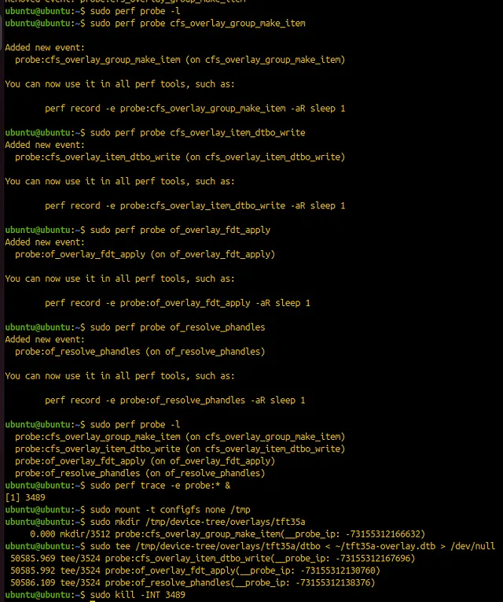
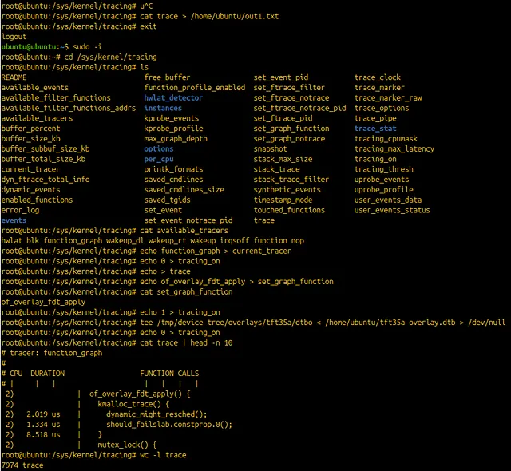
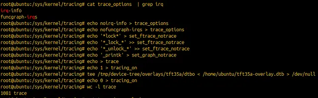
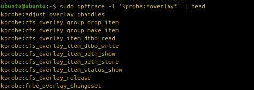
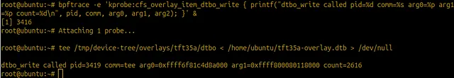
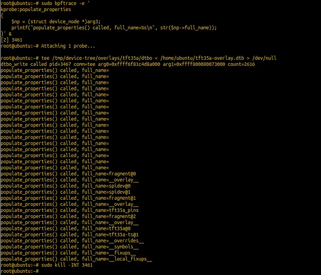
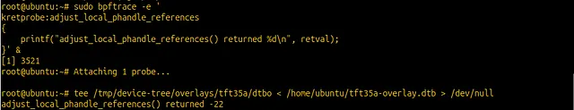
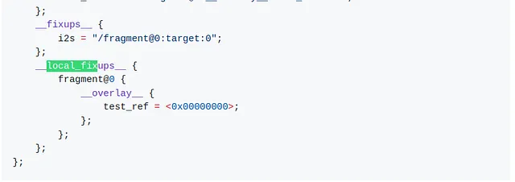
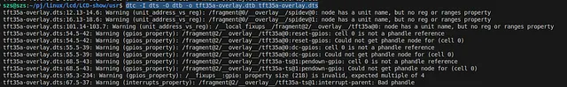
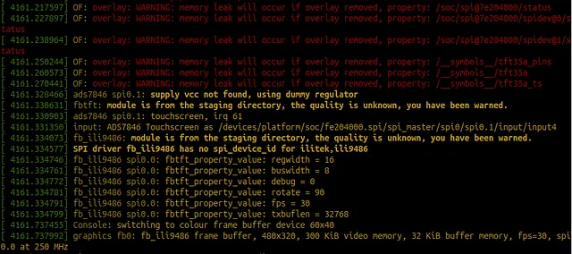

## From touch LCD to Rust Kernel Driver: A Kernel Hacking Odyssey — Part 2: perf, ftrace & eBPF

Its great that you still seem interested in my kernel hacking journey. Last time I introduced the problem and we walked through the kernel configfs and overlay subsystems in detail. We saw how the kernel code reacts to applying the overlay file and were able to pinpoint the error message print command in the kernel sources, a first step in solving the initial problem of getting the overlay file successfully applied.

In this part, the next step is to validate those findings using kernel analysis and tracing tools, and to push the investigation a bit further. The broader goal here is not just to fix this one issue, but to learn how to use the tooling that Linux provides for observing and analyzing kernel behavior. Linux offers a wide range of utilities for collecting statistics, monitoring system state, and tracing events that occur inside the kernel, both synchronously and asynchronously.

We will be touching upon only 3 different analysis tools namely, perf, ftrace and eBPF. These tools are closely related in terms of the kernel mechanisms they rely on, but each shines in different scenarios and at different levels of abstraction. A very good comprehensive summary of some kernel tracing options can be found here → https://jvns.ca/blog/2017/07/05/linux-tracing-systems/. I would highly recommend going through this article since it covers key differences between tools and the underlying kernel mechanisms that assist such tools in capturing kernel events. So, I will assume that you have gone through this article and that you are atleast aware that kprobes, uprobes, tracepoints exist and abit about how perf, ftrace and eBPF use them to their advantage. I don’t expect newbies to grasp these concepts from just the mentioned article, but no problem, I will shed more light onto these concepts in the context of our example, which should help in understanding these kernel candies.

### Perf
Perf is a low-level, event-driven profiling tool that’s been around in the kernel for a long time and is usually the first thing people reach for when they want to understand what the system is doing. Perf can measure both hardware and software events. On the hardware side, this includes things like CPU cycles, instructions completed, cache references and misses, and branch mispredictions. On the software side, it can track kernel events such as context switches, page faults, scheduler activity, and system calls. Perf is tightly integrated with the kernel and can an attach to kernel code profilers like tracepoints, kprobes, uprobes, and hardware performance counters, and because all of this profiling instrumentation already exists in the kernel, perf can collect a lot of useful information with relatively low overhead. Another useful aspect of perf is how flexible it is in terms of scope. You can profile the entire system, or narrow things down to a specific process, PID, or even a single thread. This is especially handy when you want to understand how one particular application interacts with the kernel.

Perf comes with a whole toolbox of subcommands (see man page or -h). A somewhat useful subcommand(for our investigation) — perf trace, tracks events triggered from userspace down to the kernel level and depicits how userspace interacts with kernel for calls that it wants the kernel to resolve.

After installing perf on the target machine, I ran perf trace on the mount command used to mount configfs.

```
ubuntu@ubuntu:~$ sudo perf trace mount -t configfs none /tmp
 ? ( ): mount/1695 … [continued]: execve()) = 0
 0.180 ( 0.010 ms): mount/1695 brk() = 0xaaab00e7f000
 0.275 ( 0.033 ms): mount/1695 faccessat(dfd: -100, filename: 0x907252d8, mode: 4) = -1 ENOENT (No such file or directory)
 0.325 ( 0.035 ms): mount/1695 openat(dfd: CWD, filename: 0x90727240, flags: RDONLY|CLOEXEC) = 3
 0.420 ( 0.007 ms): mount/1695 close(fd: 3</usr/lib/locale/locale-archive>) = 0
 0.453 ( 0.078 ms): mount/1695 openat(dfd: CWD, filename: 0x9073de80, flags: RDONLY|CLOEXEC) = 3
 0.542 ( 0.038 ms): mount/1695 read(fd: 3</usr/lib/locale/C.UTF-8/LC_ADDRESS>, buf: 0xffffd877a250, count: 832) = 832
 0.694 ( 0.029 ms): mount/1695 mprotect(start: 0xffff906f7000, len: 65536) = 0
 0.815 ( 0.008 ms): mount/1695 close(fd: 3</usr/lib/locale/C.UTF-8/LC_ADDRESS>) = 0
 0.859 ( 0.045 ms): mount/1695 openat(dfd: CWD, filename: 0x90730510, flags: RDONLY|CLOEXEC) = 3
 0.913 ( 0.017 ms): mount/1695 read(fd: 3, buf: 0xffffd877a230, count: 832) = 832
 0.993 ( 0.024 ms): mount/1695 mprotect(start: 0xffff90684000, len: 61440) = 0
 1.142 ( 0.008 ms): mount/1695 close(fd: 3) = 0
 1.206 ( 0.068 ms): mount/1695 openat(dfd: CWD, filename: 0x90730a50, flags: RDONLY|CLOEXEC) = 3
 1.284 ( 0.030 ms): mount/1695 read(fd: 3, buf: 0xffffd877a1f0, count: 832) = 832
 1.378 ( 0.023 ms): mount/1695 mprotect(start: 0xffff90513000, len: 65536) = 0
 1.483 ( 0.008 ms): mount/1695 close(fd: 3) = 0
 1.523 ( 0.043 ms): mount/1695 openat(dfd: CWD, filename: 0x90730f90, flags: RDONLY|CLOEXEC) = 3
 1.574 ( 0.015 ms): mount/1695 read(fd: 3, buf: 0xffffd877a1d0, count: 832) = 832
 1.662 ( 0.024 ms): mount/1695 mprotect(start: 0xffff904b0000, len: 61440) = 0
 1.804 ( 0.007 ms): mount/1695 close(fd: 3) = 0
 1.854 ( 0.044 ms): mount/1695 openat(dfd: CWD, filename: 0x907315a0, flags: RDONLY|CLOEXEC) = 3
 1.907 ( 0.016 ms): mount/1695 read(fd: 3, buf: 0xffffd877a1b0, count: 832) = 8
.
.
 8.054 ( 0.006 ms): mount/1695 getuid() = 0
 8.067 ( 0.006 ms): mount/1695 getgid() = 0
 8.079 ( 0.021 ms): mount/1695 faccessat(dfd: -100, filename: 0x906e4a10, mode: 6) = 0
 8.117 ( 0.346 ms): mount/1695 mount(dev_name: 0xe83720, dir_name: 0xaaab00e83740, type: 0xaaab00e83700) = 0.
 8.507 ( 0.008 ms): mount/1695 close(fd: 1) = 0
 8.526 ( 0.007 ms): mount/1695 close(fd: 2) = 0
 8.634 ( ): mount/1695 exit_group()
 ```

The output is interesting because it shows the entire userspace path leading up the actual filesystem mount command. The first line shows the ‘mount’ application itself (which can be found in /usr/bin directory), which triggers userspace requests to the kernel. Then we see a long sequence of file accesses openat(), read(), close() probably accessing configuration files or resources along with repeated mprotect() calls that I suppose are related to setting up memory protections within the process addressspace (I have replaced repeated chunk of the output with dots..). The key moment appears at the end mount(dev_name: 0xe83720, dir_name: 0xaaab00e83740, type: 0xaaab00e83700), which is the actual mount() system call and is the point where userspace finally crosses into the kernel space and asks the kernel to mount the filesystem. But, we don’t see any further internals of what the kernel is doing after the syscall handler (we will look into why this is a bit later). The last exit_group() is the final syscall the process makes when it terminates which means that the kernel work to mount is complete by this point.

> newbies: The systemcalls itself are defined in the kernel source code with the help of a macro SYSCALL_DEFINEX (where X specifies the number of parameters the syscall expects), e.g., https://elixir.bootlin.com/linux/v6.8/source/fs/namespace.c#L3875. They are defined in various directories across the kernel code depending on their application area.

> Note: I can’t understand why the time shows 8.634. I’m not sure if it means seconds or milliseconds..or maybe ticks or some other inter-dimensional quantum scale timing. The man page refers it to being in seconds..but for the life of me I can’t understand how it can be seconds when the output is instantaneous. If I use the time command, e.g. time sudo perf trace mount -t configfs none /tmp…I get this output at the end:

    real 0m0.737s
    user 0m0.011s
    sys 0m0.067s

> which clearly shows that the whole command took less than a second. If anyone has an answer, feel free to mention it in the comments.

Moving forward with the next command, sudo perf trace mkdir tft35a, we can see a similar output with alot of successive mmap()s and openat()s and then the main syscall mkdirat() at the end. Again, very little shown on what is going on on the kernel side. This is because perf trace by default explicitly traces syscalls (or rather tracepoints related to syscalls), since kernel internal events are noisier (and can overwhelm the output).

In order to also see kernel activity (via kernel tracepoints), the kernel tracepoints available to the perf command need to be activated. The complete list of kernel tracepoints can be viewed first via sudo perf list tracepoint and then selected tracepoints can be enabled via -e option. Unfortunate for us though, it seems like there are no tracepoints available for the configfs infrastructure (greping configfs from the output list didn’t show anything), which can also be confirmed by search for TRACE_EVENT in the configfs kernel sources. So while perf is excellent for syscall-level tracing and for subsystems that already expose tracepoints, it cannot help us peek inside configfs internals in this case by just using tracepoints, unless we manually add tracepoints to the kernel code ourselves and then recompile the son of a b***h. So, this is where kprobes prove to be advantageous.

kprobes are a general purpose dynamic probing framework. ‘Theoretically’, kprobes can be attached to any instruction in the kernel. When a kprobe is registered to a specific address, the kernel adds a breakpoint to that instruction which causes the CPU to trap allowing you to inspect the instruction and its surroundings (registers, etc.). However, practically there a number of caveats, e.g., determining the exact offset of the instruction in the compiled kernel binary image can be a bit tricky. Also a bit knowledge about the framework we want to analyze is necessary otherwise we won’t know which functions to attach the probes to (the fruits of our struggle in going through the sources in part 1 become apparent here :). The kernel explicitly exports a krpobeable symbol table which can be listed via /proc/kallsyms. One could grep for function relevant to a particular framework by greping for a particular prefix, e.g., cat /proc/kallsyms | grep of_. If you really want to track a funciton that is not exported symbol then the address of the function has to be found in the object file, e.g., disassembling the kernel with objdump tool to locate the function and then attaching a probe to the specific address instead of the name of the function(but again, can be abit tricky since a number of prerequisites for this need to implemented for this to work). We will see if we need to do this for our analysis.

So, lets start analyzing the command that we know is failing using kprobes, i.e., copying contents of the overlay dtb to the relevant file in the mounted configfs. From part 1, we know some of the functions that are involved already in this process, we can try to attach kprobes to those functions and see what happens.



In the image above, I first attach probes to selected function before adding the probe to the trace and then running the commands. The affirmation after attaching a probe to each function verifies that the function is exported in the symbol table. An event is fired whenever the probed instructions (in our case, the functions itself) are triggered. So, this verifies our hypothesis of the functions that are being triggered when we try to apply the overlay. We could also attach probes to all the ‘of_overlay’ subsystem functions via sudo perf probe “of_overlay*” to note which specific functions are triggered by the command, but that is not all that helpful. What would be very helpful is getting a callgraph stack of all the main functions that are triggered associated with the command. This is a good point to introduce ftrace which simplifies the goal we want to achieve.

### ftrace
While perf is a good generalized tool for system performance which has evolved to also allow users to debug kernel related events, ftrace was designed specifically for debugging the kernel. It has a rich infrastructure backend implemented into the kernel. Originally, ftrace was exposed to user via a filesystem interface, but now various tools like trace-cmd(built specifically for ftrace) can be used to simplify user experience. Perf itself has been integrated with the ftrace infrastructure where the perf ftrace essentially acts as a wrapper around ftrace and uses the underlying ftrace framework to record kernel function events.

The ftrace infrastructure relies on a clever use of existing compiler inserted calls combined with dynamic NOP patching. During compilation a special fentry is added to the start of every function (and corresponding fexit at the end of the function). These hooks are replaced with NOPs at boottime so that tracing is disabled by default to nullify any overhead. The fentry/fexit hooks on specific functions can then be ‘dynamically’ enabled via the ftrace tool. The overhead introduced by these hooks is smaller than kprobes. ftrace can also track krpobes and tracepoints making it a more generalized debugging tools.

To understand how it actually works, I think starting with the filesystem interface is a good idea, since its usage is very granular and mostly sequential. The ftrace filesystem interface lives under /sys/kernel/tracing. It exposes a number of files, and the purpose of most of them is well explained in the associated README. Below is just a summary of the function of some of the files.

* available_tracers — read lists all ftrace tracer types available
* hwlat — detects hardware-induced latency by running an isolated busy loop.
* blk — traces block I/O layer operations (e.g., read/write requests).
* function_graph — traces function call graphs with entry/exit timings.
* wakeup_dl — traces wakeups of deadline-scheduled tasks.
* wakeup_rt — traces wakeups of real-time (RT) tasks.
* wakeup — traces all task wakeups regardless of policy.
* irqsoff — traces sections of code where interrupts are disabled.
* function — traces every kernel function entry.
* nop — disables all tracing (no tracer active).
* current_tracer — selects which tracer is currently active, e.g., cat function > current_tracer
* available_filter_functions — lists all functions you can filter for tracing.
* set_ftrace_filter — specify which functions to trace.
* set_ftrace_notrace — exclude specific functions from tracing.
* set_graph_function — limit function graph tracing to specific functions.
* set_graph_notrace — exclude specific functions from function graph tracing.

The above mentioned files are used specifically for tracing the function tracing via special NOP added in the kernel. For tracepoints tracking and kprobes the following files can be used:
* available_events — lists all tracepoints you can enable.
* set_event — enable or disable specific trace events.
* set_event_pid — restrict event tracing to certain process IDs.
* events/ — directory of all tracepoint categories (where you can manually enable events).
* dynamic_events — shows dynamically added events (kprobes/uprobes).
* kprobe_events — define new kernel probe events.

And in order to trigger the trace (activate/deactivate it), thefollowing files are used:
* tracing_on — master switch that enables or disables tracing globally for all tracing types (tracepoints, kprobes, uprobes, function tracing, etc.).
* trace — shows the current contents of the trace buffer (a snapshot of all recorded trace entries).
* trace_pipe — similar to trace, but it streams the trace output live as it’s being written.

So, let’s say we want to understand how the kernel reacts once of_overlay_fdt_apply() is called while applying the overlay file. One way to do this is by using the function_graph tracer in ftrace as shown below:



With this enabled, the trace file will contain the full call graph that occurs during the execution of of_overlay_fdt_apply(). The first thing you’ll notice is that the amount of output is… intimidating. In my case it was on the order of ~8000 lines. Realistically, nobody is going to sit down and manually reason about a call graph that large. After a quick skim through the output, a clear pattern emerges: a significant portion of the trace is noise. There are tons of calls related to IRQ handling, lock/unlock paths, scheduler internals, and other generic kernel plumbing. While important in general, they don’t help much for understanding the overlay logic itself. If we can get rid of those, the trace becomes a lot more readable.

This is where ftrace’s filtering support becomes very handy. Using the set_ftrace_notrace file, we can tell ftrace to explicitly ignore certain functions so they don’t show up in the function graph output. By filtering out common locking primitives, IRQ helpers, and similar functions, the trace already shrinks considerably. I also noticed that a surprisingly large chunk of the output was coming from _printk() paths. Since logging isn’t relevant to the control flow we’re trying to understand here, I disabled those as well. With these filters in place, the resulting call graph is much cleaner and abit usable for reasoning about what of_overlay_fdt_apply() is doing internally.



This reduces the number of lines which certainly simplifies analyzing the output. This final output as shown below (I also disabled kmalloc() output and placed dots where functions were repeatedly called in a loop or recursively to shorten the display:
```
# tracer: function_graph
#
# CPU  DURATION                  FUNCTION CALLS
# |     |   |                     |   |   |   |
 1)               |  of_overlay_fdt_apply() {
 1)               |    kmalloc_trace() {
 1)   2.093 us    |      dynamic_might_resched();
 1)   1.277 us    |      should_failslab.constprop.0();
 1)   8.556 us    |    }
 1)   1.277 us    |    dynamic_might_resched();
 1)   1.278 us    |    dynamic_might_resched();
 1)   1.296 us    |    of_changeset_init();
 1)               |    __kmalloc()
 1)               |    of_fdt_unflatten_tree() {
 1)   1.371 us    |      dynamic_might_resched();
 1)               |      __unflatten_device_tree() {
 1)               |        unflatten_dt_nodes() {
 1)               |          populate_node() {
 1)   3.778 us    |            populate_properties();
 1)   8.686 us    |          }
                              .
                              . (populate_node() called repeatedly)
                              .
 1)               |          populate_node() {
 1)   1.889 us    |            populate_properties();
 1)   5.037 us    |          }
 1) ! 120.870 us  |        }
 1)               |        kernel_tree_alloc() {
 1)               |          __kmalloc()
 1) + 32.092 us   |        }
 1)               |        unflatten_dt_nodes() {
 1)               |          populate_node() {
 1)   2.537 us    |            populate_properties();
 1)   2.297 us    |            of_get_property();
 1)   9.259 us    |          }
                               .
                               . (populate_node() called repeatedly)
                               .
 1)               |          populate_node() {
 1)   1.982 us    |            populate_properties();
 1)   2.333 us    |            of_get_property();
 1)   8.500 us    |          }
 1)   1.297 us    |          reverse_nodes();
 1)   1.278 us    |          reverse_nodes();
 1)   1.278 us    |          reverse_nodes();
 1)   1.260 us    |          reverse_nodes();
 1)   1.500 us    |          reverse_nodes();
 1)   1.296 us    |          reverse_nodes();
 1)   1.315 us    |          reverse_nodes();
 1) ! 191.760 us  |        }
 1) ! 353.482 us  |      }
 1) ! 359.037 us  |    }
 1)               |    of_overlay_apply() {
 1)               |      of_resolve_phandles() {
 1)   0.982 us    |        __of_find_all_nodes();
 1)   0.833 us    |        
                               .
                               . (__of_find_all_nodes() called repeatedly)
                               .
 1)   0.685 us    |        __of_find_all_nodes();
 1)   0.629 us    |        idle_cpu();
 1)               |        adjust_overlay_phandles() {
 1)               |          of_get_next_child() {
 1)   0.926 us    |            of_node_get();
 1)   0.648 us    |            of_node_put();
 1)   5.463 us    |          }
                               .
                               .(adjust_overlay_phandles() called recursively)
                               .
 1)               |          of_get_next_child() {
 1)   0.649 us    |            of_node_get();
 1)   0.667 us    |            of_node_put();
 1)   4.500 us    |          }
 1) ! 233.203 us  |        }
                               .
                               . (of_get_next_child() called repeatedly)
                               .
 1)   1.796 us    |        adjust_local_phandle_references();
 1)   2.241 us    |        of_node_put();
 1) # 7163.185 us |      }
 1) # 7165.981 us |    }
 1) # 7642.092 us |  }

```
This gives us much better insight into which functions are actually being called inside the kernel, and it further confirms what we learned in Part 1 by manually walking through the source code. (Understanding the source code would have been sooo much easier if we had knowledge of ftrace in part 1:).

However, one thing clearly stands out: the last function reached in the call graph is adjust_local_phandle_references() . This could be a clue that the error -22 is generated by this function, which is propagated back to of_resolve_phandles(), where the complete error message is printed. (https://elixir.bootlin.com/linux/v6.8/source/drivers/of/resolver.c#L159). Looking at the function description in the sources (above the function definition), we see that it is responsible for resolving phandles in the __local_fixups__ section of the overlay.

As a next step, it makes sense to investigate the phandle handling, particularly within the __local_fixups__ section. To do that efficiently, we move on to an even more powerful and flexible tool, eBPF, which will help observe the framework and function in finer detail.

btw, the same output could have been achieved using the trace-cmd, e.g.,
```
sudo trace-cmd record -p function_graph \
    -g of_overlay_fdt_apply() \
    -n ‘*_lock*’ \
    -n ‘*_unlock*’ \
    -n ‘_printk*’ \
    -O noirq-info \
    -O nofuncgraph-irqs &

sudo tee /tmp/device-tree/overlays/tft35a/dtbo < ~/tft35a-overlay.dtb > /dev/null

sudo trace-cmd stop
sudo trace-cmd extract
trace-cmd report.
```

## eBPF
eBPF is essentially a way to run user-defined code inside the kernel. It uses an intermediate instruction set that executes inside a small virtual machine in the kernel. This allows safely injecting logic into the kernel without writing or loading full kernel modules.

Historically, BPF started as “classic BPF” and was designed purely for network packet filtering. A very small virtual machine (VM) was added to the kernel, with a limited instruction set, strict memory access rules, and heavy restrictions to ensure safety. Users could write filter programs (originally in a small assembly-like language), load them into the kernel, and have them run on incoming packets. If a packet matched the filter, it would be copied to userspace. This method proved to be advantageous in efficiently filtering out packets that the user required since all the filtering was taking place in the kernel as they were being recieved by the network (and could be rerouted accordingly if needed), instead of first copying all the packets to userspace and then applying the filter.

eBPF relies on this same concept. It lets you run sandboxed, user-written programs inside a running kernel without having to change kernel source code or loading kernel modules. More precisely, it is an in-kernel virtual machine that executes a restricted instruction set known as BPF bytecode. To ensure the program is safe to run in the kernel, the code is passed through a specicial verifier, afterwhich it is compiled via JIT compiler to translate the verified bytecode to native machine code.

There are two main ways to write eBPF programs: 1) Write restricted C code and compile it with Clang/LLVM targeting the BPF backend. 2) Use higher-level frameworks and languages such as Go or Rust, which provide libraries and tooling that eventually compile down to eBPF bytecode under the hood.

eBPF programs run inside the kernel address space at well-defined hook points such as kprobes, tracepoints, XDP, etc. These hook points define when and where the program is allowed to execute. Therefore, every eBPF program must declare a type that tells the kernel what kind of hook it can attach to, e.g., BPF_PROG_TYPE_KPROBE, BPF_PROG_TYPE_TRACEPOINT. This means that when this hook is reached, the kernel triggers the bpf program to run and analyze that part of the source code. To exchange the data between the bpf code in the kernel and userspace, eBPF relies on a special BPF maps (generic key-value data structures). The kernel exposes syscalls that allow the user to read from and write to these maps.

A typical eBPF workflow looks like this:
The user writes restricted C code, which is compiled into BPF bytecode (usually packaged as an ELF .o object). A userspace loader then calls the bpf() syscall. The kernel verifier runs a series of checks (no unbounded loops, no out-of-bounds memory access, no invalid pointer arithmetic, guaranteed termination, etc.). If verification succeeds, the program is JIT-compiled into native code. The program is then attached to a chosen hook into the running kernel. When an event fires at that hook, the eBPF program runs, updates maps, and optionally pushes events back to userspace which the userpsace can they retrieve using the specific bpf defined syscalls.

So, to summarise, the main difference is that the eBPF framework lets you run custom code inside the kernel whenever an event (hook) happens, whereas perf trace and trace-cmd are mostly limited to just logging that an event occurred. This gives you a whole lot more flexibility. As long as there’s a hook in the kernel for the event you want to inspect, eBPF can even influence outcomes in some cases, without having to recompile the kernel or a module. On top of that, eBPF provides additional hooks specific to the framework itself, so the range of things you can attach to is much wider. If your kernel is built with CONFIG_BPF and BTF, tools like bpftrace can hook into almost any kernel function. On older kernels without these options, you can still attach probes using exported symbols or tracepoints, assuming the symbol or event is visible.

eBPF has been gaining a lot of traction in the kernel world in recent years. I found it abit difficult to comprehend eBPF, especially since online tutorials are somewhat limited or fragmented or assume prior knowledge. I’ve tried my best to summarize the core ideas behind eBPF here (from what I have understood), but i am sure it is still abit of confusion, which I hope to remove via examples using the bpftrace tool.

bpftrace is a tool that lets you attach eBPF programs to the kernel or userspace events using short, awk-like one-liner codes. bpftrace offers a lot of functionality, so let’s go step by step and first use it to inspect the function we’re interested in cfs_overlay_item_dtbo_write(). I won’t go through every bpftrace option here—that would turn into a never-ending story. Instead, I’ll only cover what’s necessary to move us toward our goal of understanding what actually happens when the overlay is written and where things start to go wrong.

We can check if the kprobe for this function existed directly using bpftrace:


so to start, lets simply print when this function is entered.


We will get to the interpretation of the output in a minute. First lets try to understand the bpftrace syntax:

* -e option is used to execute the bpftrace program directly from the commandline. Alternatively, you can put the scrip into a .bt file and run with bpftrace file.bt.
* A bpftrace program is made up of a preamble and one or more action blocks. Each action block has 3 parts: 1) Probe — which specifies what event to attach to and what type of event it is. In our example ‘kprobe:cfs_overlay_item_dtbo_write’. 2) Predicate — which is optional and acts as a condition (e.g. some scenario in the kernel must have happened) which must evaluate to true for the action to run. 3) Action — which is the code that runs when the event fires, the printf(..) in our example.
* Special blocks like BEGIN {} and END {} can also be used to initialize variables, print headers, or do cleanup. BEGIN runs when bpftrace starts, and END runs when it exits.
* Like printf(), bpftrace provides a lot of built-in functions to inspect kernel data and collected state, so you can write logic that feels quite C-like. When it comes to variables, bpftrace supports two main kinds: 1) Scratch variables — which are stored on the BPF stack and accessed via $var. 2) map variables which correspond the ebpf maps and can be used to store data across events. There are also many built-in variables that bpftrace initializes based on context, such as pid, tid, comm, arg0, arg1, etc. In our command, we used some of these to print information about the current process and function arguments.

So the output from our first ebpf command is quite straight forward. It does what we asked it to do, to print the process pid, userspace command and parameters passed to the kprobed function.

ssize_t cfs_overlay_item_dtbo_write(struct config_item *item, const void *buf, size_t count);

arg0, arg1 and arg2 prints the address of the struct config_item (coming from configfs), the buffer pointer holding the DTB data, and the count (which is the size of that buffer in bytes) respectively. So, that’s cool. If we have the address of a structure, we can actually inspect its contents. eBPF makes this fairly easy because, with BTF enabled, kernel structure definitions are available as type information. That means the layout of kernel structs is known at runtime, and individual fields can be safely accessed and printed directly from an eBPF program. This lets us introspect kernel data structures without guessing offsets or rebuilding the kernel with extra debug code.

As a next step, what would be interesting is seeing how the nodes defined in the overlay are actually created and populated by the kernel. From the ftrace graph filter of the function of_overlay_apply() above, we noticed that unflatten_dt_nodes() shows up in the call graph, which then calls populate_node(). That function appears to allocate and initialize a struct device_node, and then passes it on to populate_properties() to fill in the properties. So the plan is to attach a bpftrace kprobe to populate_node() and inspect its parameters — at the very least, extract the node name being created from the overlay as it flows through this path. This should give us a concrete view of which nodes are being instantiated and in what order during overlay application.



Aha — so that already gives us useful information, corresponding to each node defined in the overlay file. That’s great. Another interesting observation is that the first ~17 calls to populate_properties() happen without a device_node that has a valid name initialized. If we look back at the call graph, we see that unflatten_dt_nodes() is invoked twice. This suggests that the full struct device_node initialization (including the node name) only happens during the second pass through unflatten_dt_nodes(). So at this point we can be fairly confident that device_node objects are being created correctly for the overlay. One nice detail here is that in the bpftrace script we were able to cast the argument directly to struct device_node and access its fields. That’s possible because bpftrace is aware of the struct device_node layout. This comes from BTF-related kernel configuration options (for example CONFIG_DEBUG_INFO_BTF), which embed kernel type metadata for use by eBPF tooling. Without BTF, we’d have to resort to manual pointer chasing and offset guessing to extract the same information.

What we can also do is inspect arguments after a function has finished executing by using a kretprobe. As the name suggests, a kretprobe by itself only gives us access to the function’s return value. So if we want to see how input arguments look on exit — for example, after the kernel has initialized or modified the. The usual approach is to capture the arguments in a kprobe (on function entry), store references to them in variables or maps, and then dereference those same pointers in the corresponding kretprobe to print their final state. Let’s do exactly that with populate_node(), which is responsible for creating and initializing a new device tree node before calling then calling populate_properties(). This function takes two device_node pointers: the parent (dad) and a pointer to the newly created child node (pnp), which is expected to be initialized by the time the function returns:

```
root@ubuntu:~# sudo bpftrace -e '
kprobe:populate_node
{
    // Save dad and pnp pointers in per-thread maps
    @dad[tid] = (struct device_node *)arg3;
    @pnp[tid] = (struct device_node **)arg4;
}

kretprobe:populate_node
{
    $dad = @dad[tid];
    $pnp_ptr = @pnp[tid];
    delete(@dad[tid]);
    delete(@pnp[tid]);

    // Dereference pnp pointer to get the device_node pointer
    $node = *$pnp_ptr;

    printf("populate_node() returned, parent full_name=%s, child full_name=%s\n",
        str($dad->full_name),
        str($node->full_name));
}' &
[2] 3480
root@ubuntu:~# Attaching 2 probes...

root@ubuntu:~# tee /tmp/device-tree/overlays/tft35a/dtbo < /home/ubuntu/tft35a-overlay.dtb > /dev/null
dtbo_write called pid=3485 comm=tee arg0=0xffff6f81c4d8a000 arg1=0xffff800080077000 count=2616
populate_node() returned, parent full_name=, child full_name=
populate_node() returned, parent full_name=, child full_name=
populate_node() returned, parent full_name=, child full_name=
populate_node() returned, parent full_name=, child full_name=
populate_node() returned, parent full_name=, child full_name=
populate_node() returned, parent full_name=, child full_name=
populate_node() returned, parent full_name=, child full_name=
populate_node() returned, parent full_name=, child full_name=
populate_node() returned, parent full_name=, child full_name=
populate_node() returned, parent full_name=, child full_name=
populate_node() returned, parent full_name=, child full_name=
populate_node() returned, parent full_name=, child full_name=
populate_node() returned, parent full_name=, child full_name=
populate_node() returned, parent full_name=, child full_name=
populate_node() returned, parent full_name=, child full_name=
populate_node() returned, parent full_name=, child full_name=
populate_node() returned, parent full_name=, child full_name=
populate_node() returned, parent full_name=, child full_name=fragment@0
populate_node() returned, parent full_name=fragment@0, child full_name=__overlay__
populate_node() returned, parent full_name=__overlay__, child full_name=spidev@0
populate_node() returned, parent full_name=__overlay__, child full_name=spidev@1
populate_node() returned, parent full_name=, child full_name=fragment@1
populate_node() returned, parent full_name=fragment@1, child full_name=__overlay__
populate_node() returned, parent full_name=__overlay__, child full_name=tft35a_pins
populate_node() returned, parent full_name=, child full_name=fragment@2
populate_node() returned, parent full_name=fragment@2, child full_name=__overlay__
populate_node() returned, parent full_name=__overlay__, child full_name=tft35a@0
populate_node() returned, parent full_name=__overlay__, child full_name=tft35a-ts@1
populate_node() returned, parent full_name=, child full_name=__overrides__
populate_node() returned, parent full_name=, child full_name=__symbols__
populate_node() returned, parent full_name=, child full_name=__fixups__
populate_node() returned, parent full_name=, child full_name=__local_fixups__
root@ubuntu:~#
```

so by grabbing pnp in kprobe and the inspecting pnp in a kretprobe, we can directly observe how the child node looks once populate_node() has finished doing it work. We also see the parent to child relationship and ca visualize how the tree structure is generated and compare it with the overlay file..which matches!

Now that we’re a bit more comfortable with bpftrace, let’s use the hint we got from ftrace and focus on the error itself — specifically adjust_local_phandle_references(). The first thing to do is attach a kretprobe and inspect the return value to confirm whether this function is indeed where the failure originates.



Doing that quickly confirms our suspicion: adjust_local_phandle_references() is returning the -22 error and is the initial point of failure. Looking at the source code for this function again, another interesting observation pops up. Even though this function is recursive, the kprobe shows it being triggered only once which suggests that the failure happens on the first invocation.

We know already that adjust_local_phandle_references() is called to resolve phandle references in __local_fixup__. So as a next step lets inspect what data is actually being passed into the function.


So, this does prove the correct structure being passed down to the function. So then a possibility of it failing could a problem in the way the structure is defined. Lets go back to the documentation for devicetree overlays shared in part 1 (https://github.com/raspberrypi/documentation/blob/master/documentation/asciidoc/computers/configuration/device-tree.adoc).

The example overlay file in the documentation:



shows the __local_fixups__ defined in a different way than how they appear in the tft35a-overlay.dtb.

```
__local_fixups__ {
  fixup = "/fragment@2/__overlay__/tft35a@0:pinctrl-0:0\0/__overrides__:speed:0\0/__overrides__:txbuflen:0\0/__overrides__:rotate:0\0/__overrides__:fps:0\0/__overrides__:bgr:0\0/__overrides__:debug:0\0/__overrides__:swapxy:0";
 };
 ```

That could be the problem since the error returned by the function is -EINVAL referring to maybe the input provided to the function being invalid. I restructured the __local_fixups__ as recommended in the documentation and converted it back to .dtb via the dtc compiler.

```
__local_fixups__ {
  fragment@2 {
   __overlay__ {
    tft35a@0 {
     pinctrl-0 = <0x0>; /* phandle starts at offset 0 */
    };
   };
  };

  __overrides__ {
   speed    = <0x0>;
   txbuflen = <0x0>;
   rotate   = <0x0>;
   fps      = <0x0>;
   bgr      = <0x0>;
   debug    = <0x0>;
   swapxy   = <0x0>;
  };
 };
 ```



Note: usually dtb compilation creates a number of warnings, some of which can be ignored, but sometimes contain important hints incase the overlay fails to apply. For now I am ignoring the warning..and get back to them if there is a problem applying the overlay.

With the updated and newly compiled DTB, I tried loading the overlay again aaaaand (drum roll please)… it worked! or at least it appears to have worked. Running dmesg after loading the overlay shows the expected output, although the LCD itself is still showing a blank screen for now.


Not only did the DTB load successfully, it also triggered the corresponding drivers: the ads7846 touchscreen driver and the fb_ili9486 display driver. So… achievement unlocked. We’re one step closer to actually achieving our goal!

I’ll leave part 2 on this high note. In the next part, we’ll look at how the driver is being loaded, what the core components of the driver are, and then try to get the LCD display actively working and responding to touch input. Once we have a solid understanding of that, we’ll move on to something more ambitious — trying to rewrite the driver in Rust. Hopefully this gave a reasonable grasp of the profiling and debugging tools discussed here. Stay tuned for more.
